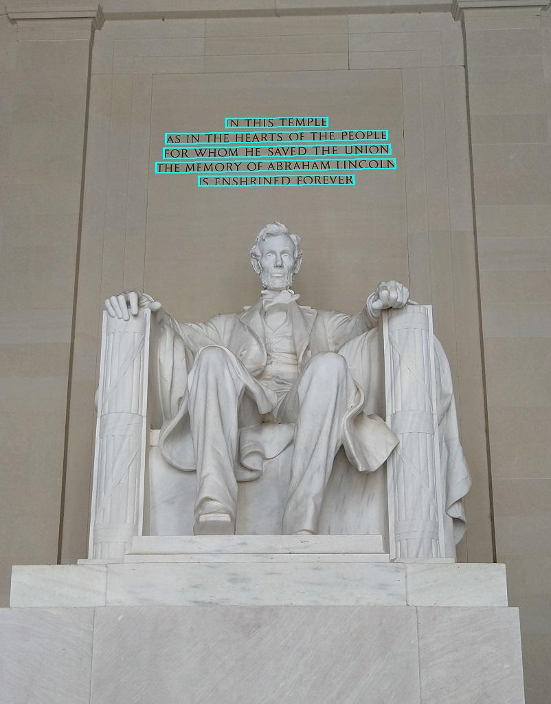

# Azure AI Vision OCR Project

Optical character recognition (OCR) is a subset of computer vision that deals with reading text in images and documents. Here, the Azure AI Vision Python SDK allows us to implement this task.

## Features

- Performs OCR using Azure's AI Vision Services.
- Supports images in `.jpg`, `.jpeg`, and `.png` formats.
- Saves annotated images with bounding polygons highlighting detected text.
- Easy-to-configure environment variables for Azure credentials.

## Installation

1. Clone the repository:

   ```bash
   git clone https://github.com/noahrubin989/OCR-Analysis.git
   cd OCR-Analysis
   ```

2. Create a `.env` file in the project root directory and add your Azure credentials:

   ```plaintext
   AI_SERVICE_ENDPOINT=<Your Azure Vision Service Endpoint>
   AI_SERVICE_KEY=<Your Azure Vision Service Key>
   ```

3. Place the images you want to analyse in the `images` directory (create it if it doesn't exist):

   ```bash
   mkdir images
   ```

## Usage

1. Run the application:

   ```bash
   python ocr_analysis.py
   ```

2. Choose the desired option from the menu:

   - Option `1` processes all valid images in the `images` folder.

3. After processing, the annotated images will be saved in the `output_images` folder.

## Project Structure

```plaintext
.
├── images/                   # Input images for OCR
├── output_images/            # Annotated images with detected text
├── .env                      # Environment variables for Azure credentials
├── requirements.txt          # Python dependencies
├── ocr_analysis.py           # Main application script
├── README.md                 # Project documentation
```

## Example Output

The application overlays detected text and bounding polygons on the image. Here's an example of what the output might look like:




## Troubleshooting

- **Error: Invalid endpoint or key:**
  Ensure that the `AI_SERVICE_ENDPOINT` and `AI_SERVICE_KEY` in your `.env` file are correct.

- **FileNotFoundError:**
  Ensure that the `images` directory exists and contains valid image files.

- **Missing dependencies:**
  Ensure all dependencies are installed using the `requirements.txt` file.
